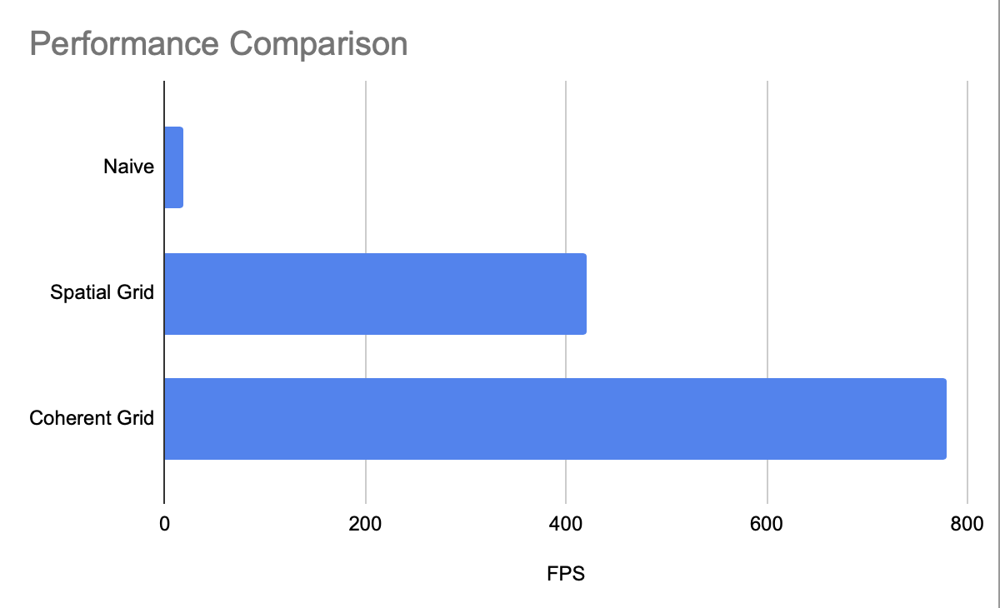

***Check out the repository for this project [here](https://github.com/SomeInternet/Project1-CUDA-Flocking/commits/main/)!***

# About
Following the curriculum for [**UPenn's GPU Programming and Architecture**](https://cis5650-fall-2025.github.io/), I implemented a boids (particles that behave like birds) simulation in CUDA on the GPU, including the boid rules, velocity checking and updating (+ ping-ponging the buffers), and position updating.


# Features
Boids are influenced by 3 rules:
* **Cohesion**: Boids fly towards a local center of mass.
* **Separation**: Boids try to maintain distance from other boids.
* **Alignment**: Boids try to match their velocity with their neighbors.

I benchmarked performance with 100,000 boids with an i9-14900HX and a RTX 4070 Mobile.

### Naive Implementation
In the naive implementation of boids flocking, each boid iterates over each other boid to determine whether it affects it. Performance was surprisingly not horrible, at ~19FPS.

### Uniform Spatial Grid
The first optimization I implemented was a uniform spatial grid. Since boids are only influenced by neighboring boids within a certain distance, by having the side length of a grid cell be twice the length of the largest radius (the radius effect for each rule can be tweaked), we can prune the neighbor searching to at most 8 grid cells in a 2x2x2 neighbood to the grid cell of the boid.

Boids have their grid cell computed and their indices are sorted by Thrust using the grid cell as the key. Then the beginning and end indices of the grid cells are computed and stored so boids can iterate over the boids of specific cells.

This spiked performance up to ~420FPS.

### Memory-Coherent Spatial Grid
Memory access is a major bottleneck in GPU operations. Because the boids within the same grid cell are not adjacent in memory, iterating over the boids within a grid cell takes more memory reads. By sorting the boid positions and velocities instead of the indicies, we make the grid cells coherent in memory.

This further bumped performance up to ~780FPS, about 40x the naive baseline.