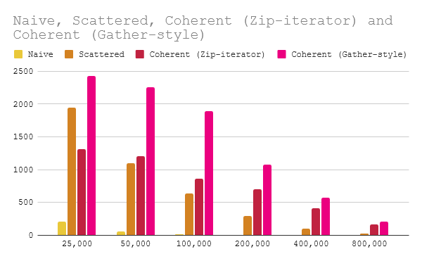
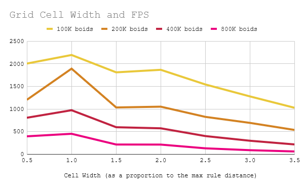
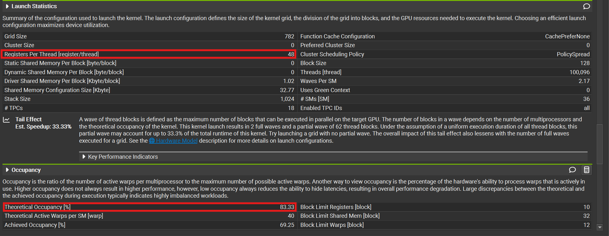
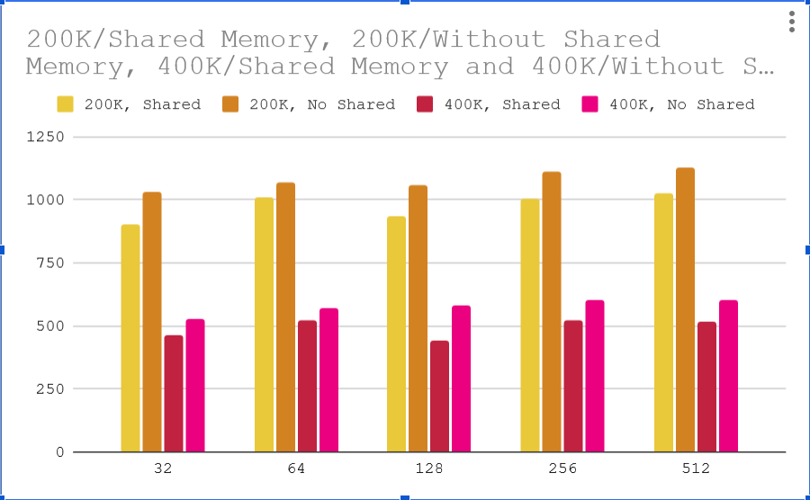
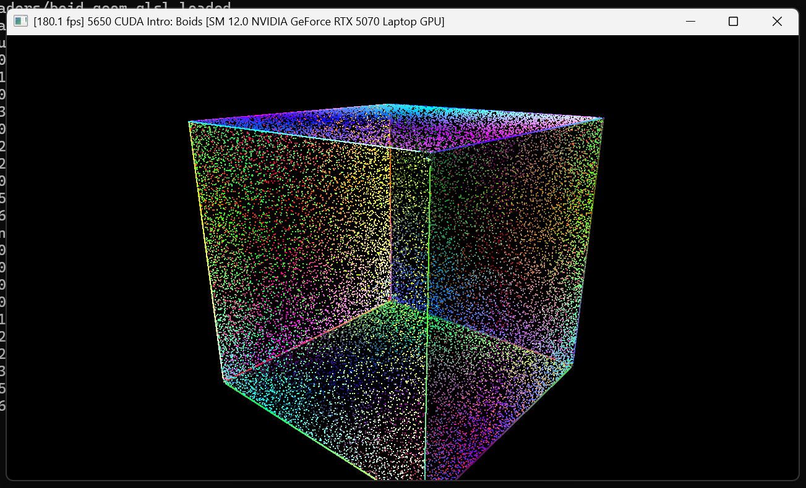

***Check out the repository for this project [here](https://github.com/SomeInternet/Project1-CUDA-Flocking-26)!***


# About
Following the curriculum for [**UPenn's GPU Programming and Architecture**](https://cis5650-fall-2026.github.io/), I implemented a boids (particles that behave like birds) simulation in CUDA on the GPU, including the boid rules, velocity checking and updating (+ ping-ponging the buffers), and position updating. I then spent most of my time optimizing it: a uniform spatial grid, two flavors of coherent memory access, tunable grid cell widths, block size tuning, and shared memory.

All benchmarks were run on Windows 11 with an Intel Ultra 9 275HX (2.70 GHz), an RTX 5070 Mobile, and 32 GB of RAM.


# What's a boid?
[Boids](https://en.wikipedia.org/wiki/Boids) are bird-like particles developed by Craig Reynolds in 1986. They're bird-like in that they exhibit flocking behavior by following 3 rules:
* **Cohesion**: boids move towards a local center of mass.
* **Separation**: boids try to keep a distance from neighboring boids.
* **Alignment**: boids try to match the velocities of neighboring boids.

These are rules 1, 2, and 3 in my implementation, and what counts as "local" or "neighboring" is controlled by the radii `rule1Distance`, `rule2Distance`, and `rule3Distance`. The new velocity is the old velocity plus the sum of the three rules.

# Implementations
### Naïve simulation (brute force)
At each time step, each boid examines the positions and velocities of every other boid from the previous time step and updates its own velocity according to the rules above, then all positions are advanced by their current velocity. That's clearly parallelizable, so it's a good fit for the GPU.

I keep 3 buffers on the GPU: `pos`, `vel1`, and `vel2`. `vel1` holds the velocities from the previous time step (which we read from), and `vel2` holds the velocities being written this step. The two are then swapped — "ping-ponging" — so this step's `vel2` becomes the next step's `vel1`.

This is easy to get running, but wasteful: most boids aren't within the radius of any rule, so nearly all of the work is thrown away. I mostly benchmarked with 100,000 boids.

### Uniform spatial grid
A much better approach is to only iterate over boids that are plausibly neighbors. By dividing the simulation space into a uniform grid, each boid only has to check the grid cells that fall within the radius of one of the rules.

I wrap `dev_particleGridIndices` and `dev_particleArrayIndices` (the grid cell of each boid, and its slot in the position and velocity buffers) in `thrust::device_ptr`s and call `thrust::sort_by_key` to sort the latter by the former. A separate kernel then finds where each grid cell starts and ends in `dev_particleGridIndices`, so a boid can iterate over exactly the boids in a given cell — at the cost of an extra layer of indirection to actually reach their positions and velocities.

### Semi-coherent memory access
Chasing pointers into unsorted position and velocity buffers is the next bottleneck, so the fix is to sort those buffers too. I tried this two ways, and the gap between them surprised me.

**Zip iterators.** Conceptually the smallest change: use `pos` and `vel1` as the *values* of the sort instead of `particleArrayIndices`. Thrust supports this directly — wrap both in device pointers, combine them with a `thrust::zip_iterator`, and hand that to the unstable sort.

**Gather-style.** Alternatively, sort `particleArrayIndices` as before and add a shuffle step that reorders `pos` and `vel1` to match. Thrust has `thrust::gather` for this, which I found only after writing my own kernel that does the same thing; in limited testing my kernel was about the same or slightly faster than the two `thrust::gather` calls needed to shuffle `pos` and `vel1`, so I used mine for benchmarking. Neither shuffles in place, so I allocated a second `pos2` buffer to shuffle into.

# Benchmarks
FPS numbers are averaged over a 20-second window with the laptop on its maximum performance profile. There's a consistent spike at the start of execution, so I discard the first 2 seconds as warmup. Higher is better on every chart below.

### Comparing the four methods
Cell width is `2 * maxRuleDistance` and block size is 128 here; grid cell width gets its own section below.



The same benchmarks with visualization turned on:


The difference between the zip iterator and the gather-style kernel is what surprised me most — the zip iterator version is actually *worse* than the plain scattered grid at lower boid counts. My guess is the overhead of shuffling two 24-byte `vec3`s instead of a single 4-byte `int`.

### Grid cell size
My original scattered and coherent grids assumed a cell width of `2 * maxRuleDistance`, which makes the neighborhood to check at most 8 cells:

```cpp
glm::vec3 gridCell = (pos[idx] - gridMin) * inverseCellWidth;
glm::ivec3 hi = glm::round(gridCell);
glm::ivec3 lo = hi - glm::ivec3(1);
```

The idea is to take the (float) grid cell the boid sits in and round to the nearest cell corner. That gives the highest cell of the 2x2x2 neighborhood, and subtracting `ivec3(1)` gives the lowest one. (I ignored the case where a coordinate lands exactly on .5, given how unlikely it is.)

To support an arbitrary cell width, I later switched to computing the bounding box of possibly-reachable cells:

```cpp
glm::ivec3 lo = glm::floor(glm::max(glm::vec3(0), gridCell - maxRuleDistance / cellWidth));
glm::ivec3 hi = glm::floor(glm::min(glm::vec3(gridResolution - 1), gridCell + maxRuleDistance / cellWidth));
```

That box is generous, so inside the loop I skip cells that can't actually contain a neighbor:

```cpp
glm::vec3 cellMin = cellWidth * glm::vec3(i, j, k) + gridMin;
glm::vec3 cellMax = cellWidth * glm::vec3(i + 1, j + 1, k + 1) + gridMin;
glm::vec3 closest = glm::clamp(posSelf, cellMin, cellMax);
if (glm::length(closest - posSelf) > maxRuleDistance) continue;
```



A cell width of 1x the maximum rule distance wins across boid counts. Shrinking the cells means more overhead finding cell start and end indices — the cell count grows with the inverse cube of the width — but it also cuts down how many boids each boid has to iterate over, and that second effect dominates here.

### Block size
Occupancy is worth tuning too. The kernel I settled on, `kernUpdateVelNeighborSearchCoherentGridLoopOptimization`, uses 52 registers per thread, and my RTX 5070 Laptop allows 1536 threads per SM and 24 blocks per SM, across 36 SMs.

To avoid being throttled by the blocks-per-SM limit I'd want at least 1536 / 24 = 64 threads per block, and to avoid being throttled by registers I'd want at most 65536 / 1536 ≈ 42 registers per thread. So I expected 64 threads per block to be the sweet spot: even with more registers than ideal, it fits as many blocks per SM as possible.


Instead, at 200K boids with a cell width of `2 * maxRuleDistance`, performance peaked at 512 threads per block.

### Shared memory
The volume of global memory reads is another candidate bottleneck. A lot of it is probably cached, since adjacent threads are more likely to be adjacent in space, but I tried staging as many boids as I could in shared memory:

```cpp
__shared__ glm::vec3 sPos[blockSize];
__shared__ glm::vec3 sVel1[blockSize];

...

if (idx < N) {
    sPos[threadIdx.x] = posSelf;
    sVel1[threadIdx.x] = vel1[idx];
}
```

Then, while iterating over neighbors, I check whether the thread owning the other boid (`pIdx`) belongs to this block:

```cpp
glm::vec3 pPos = (pIdx >= blockIdx.x * blockDim.x && pIdx < (blockIdx.x + 1) * blockDim.x) ?
    sPos[pIdx - blockIdx.x * blockDim.x] :
    pos[pIdx];

glm::vec3 pVel = (pIdx >= blockIdx.x * blockDim.x && pIdx < (blockIdx.x + 1) * blockDim.x) ?
    sVel1[pIdx - blockIdx.x * blockDim.x] :
    vel1[pIdx];
```

This isn't the best way to use shared memory — it hopes that neighboring threads hold spatially nearby boids, which isn't a great assumption given how the grid cells are numbered. With more time I'd have liked to try something like a Z-order curve instead.

So it isn't too surprising that shared memory didn't buy much. What did surprise me was how much it *cost* in initial testing. Profiling with NSight Compute (Saahil pointed me at register pressure) shows why:




Register use jumps from 48 to 63, and NSight warns that occupancy drops as a result. I went back and scoped parts of the shared memory path more tightly, bringing it down to 52 registers, and re-benchmarked:



Even then, shared memory underperformed at every configuration I tested, including some not shown here. I'm not certain that's the cause, but comparing the updated profiles, the shared memory version (first below) executed significantly more instructions.


# Blooper (singular)
I'd put more bloopers here, but I only really have the one funny-looking one. While implementing one of the optimizations my FPS tanked, so I turned on visualization to get an idea of what was going on and was greeted by **the cube**.



I never did figure out the cause, but with the boids packed that densely — especially along the edges of **the cube** — it's easy to see why performance would degrade, since each boid ends up iterating over far more neighbors.
