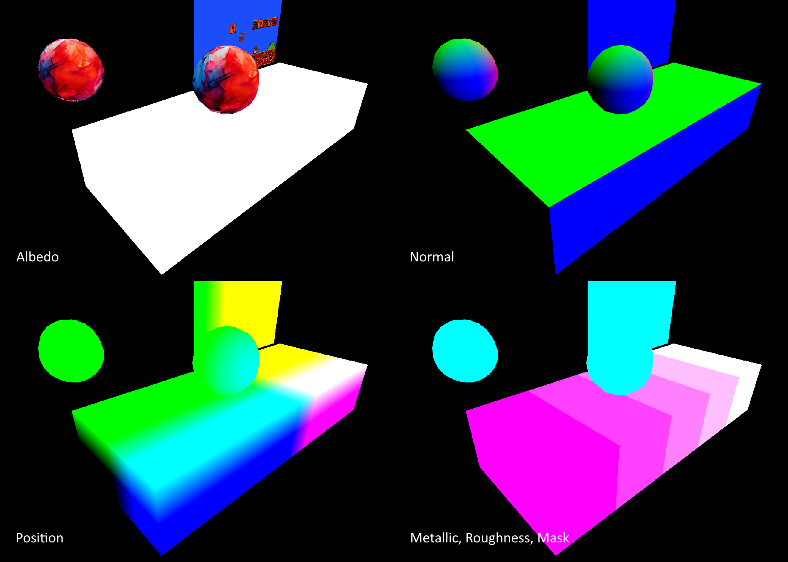
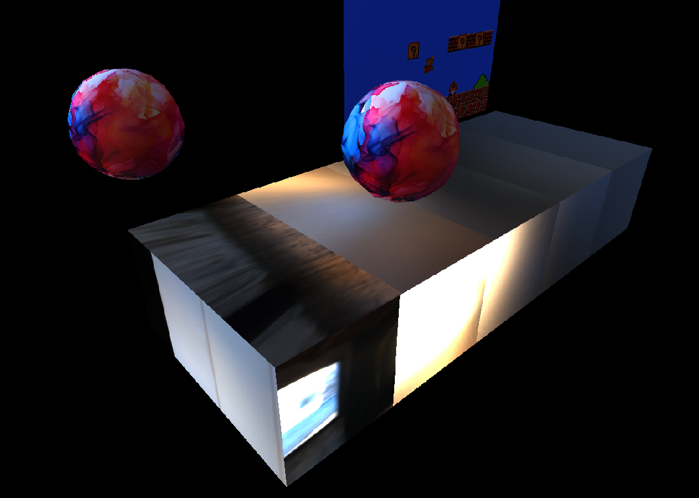
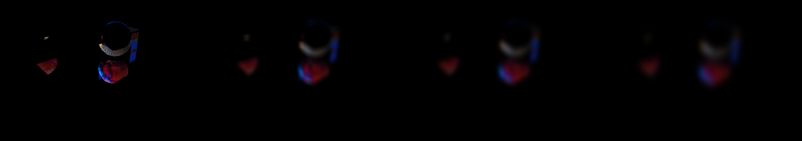
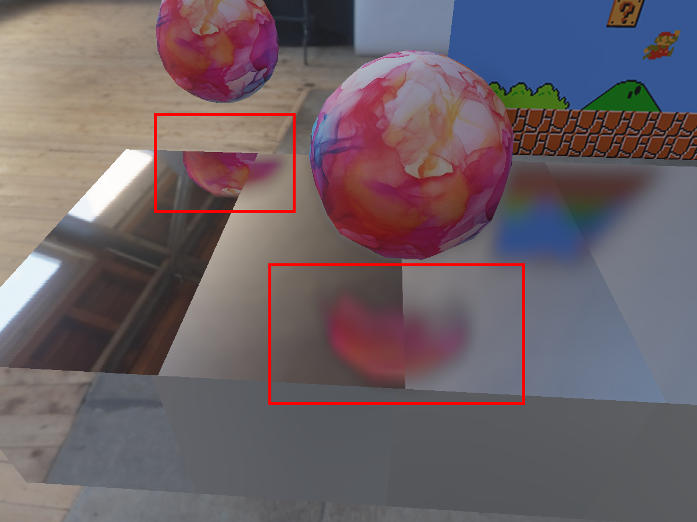

***Since this was coursework, I can't make the project code public. Please reach out privately if interested!***

# About
First, fragment properties were saved into the G-buffer. This included the albedo, the world space position, the normal, and PBR factors like metallic (red channel) and roughness (blue channel). The mask (green channel) simply denoted the presence or lack of geometry for screen space reflection calculations.

The physically based shading of the materials had to be computed prior to the screen space reflections. Diffuse and glossy convolution were used to compute the environment map reflections on the objects.

The reflections were computed through screen space raymarching rather than world space raymarching for optimization with a limited number of iterations (that way, we didn't waste time searching the same pixel of the G-buffer). The effect on material roughness on the reflections was naively approximated by creating blurred versions of the reflection, then interpolating between them using the roughness value.

The result is good-enough looking reflections that take into account varying material roughnesses.
