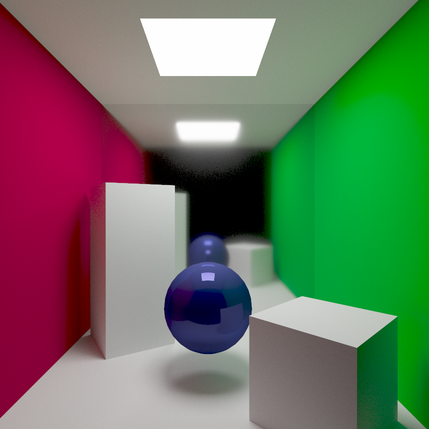
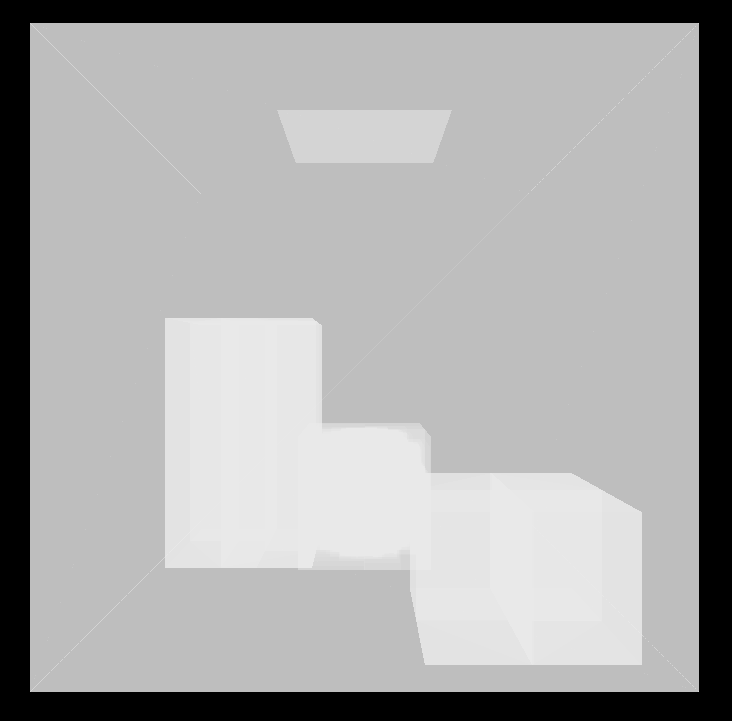

***Check out the repository for this project [here](https://github.com/SomeInternet/Tsuki-Engine)!***

# About
The Tsuki Engine is a Vulkan-CUDA interop render engine with a real-time Vulkan viewport and a Monte Carlo pathtraced CUDA view, made from scratch in C++, CUDA, and Slang. It supports glTF loading with physically-based materials, creating top-level and bottom-level acceleration structures on the host before uploading them to the device.


# Features
## Vulkan-CUDA Interop
It features zero-copy memory sharing between Vulkan and CUDA by exporting Vulkan device memory as external OS handles, then importing them to CUDA as external memory.

Basic Synchronization between Vulkan and CUDA is enforced through Vulkan semaphores exported to CUDA, where 1 semaphore is signalled by CUDA whenever it takes a sample, allowing Vulkan to copy the accumulated image buffer from CUDA to a draw image where a Vulkan compute shader performs tone-mapping and gamma correction, and the other semaphore is signaled by Vulkan when the copy is complete, allowing CUDA to take another sample.

## Pathtracing Features
Physically based microfacet materials via Cook-Torrance and GGX. This example render shows a blue plastic ball with `metallic = 0, roughness = 0`, and a slightly rough metal mirror with `metallic = 1, roughness = 0.1`.

As an optimization, I VNDF-sampled (visible normal distribution function) the micronormal `wh`, which selects micronormal directions the camera can actually see. I importance sampled the glossy and diffuse lobes based on how metallic the material is.

To make rendering complex models feasible, I implemented a 2-tier acceleration structure, with bottom-level and top-level acceleration structures. The top-level acceleration structure is created by using the equal primitive heuristic on the AABB's (axis-aligned bounding boxes) of the bottom-level acceleration structures, where the bottom-level acceleration structures are created using the surface area heuristic. All acceleration structures are created on the host, before being copied into device memory.

## Vulkan Viewport
The objects are loaded into a scenegraph structure, based on VkGuide's Vulkan engine. The TLAS is created when the scenegraph is queued for drawing. As my pathtracer uses a material lookup system, I opted to use a bindless rendering system where vertices store their own material ID's, and the fragment shader looks up material properties. I provide an option in the GUI to visualize the bottom-level acceleration structures:

# Future Plans
I'm continuing to work on the engine to make it better! Some features I am currently working on:
* Texture support for albedo normal, and PBR properties
* Importance sampling of mesh lights
* Transmissive materials
* Physically-based rasterization (e.g. SSR, AO)
* Physically accurate camera (thin/thick lens approximation)

# Attributions
* UPenn CIS 5650 Curriculum
* VkGuide
* Vulkan Tutorial
* PBRT, 3e.
* UPenn CIS 5610 Curriculum
* NVIDIA Docs
* NVIDIA CUDA Samples Repo

**Libraries**
* GLM
* GLFW
* ImGUI
* fastGLTF
* VMA
* stb
* Thrust