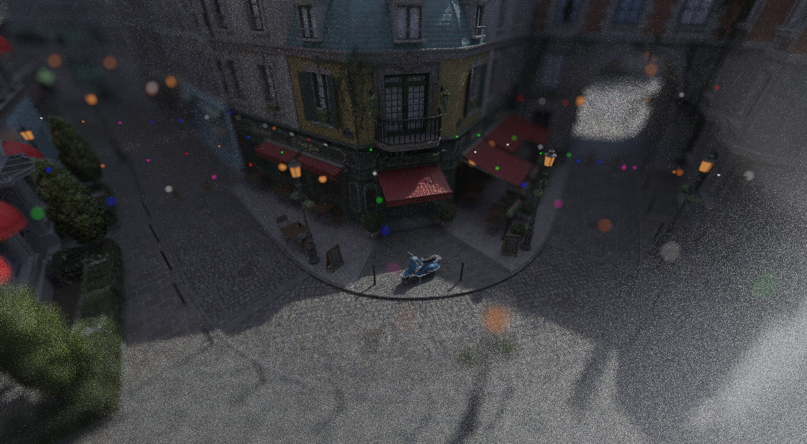
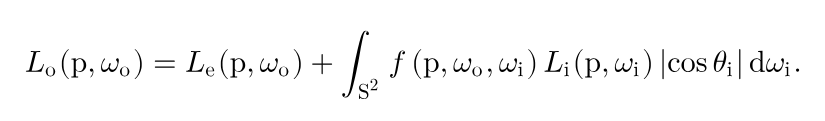
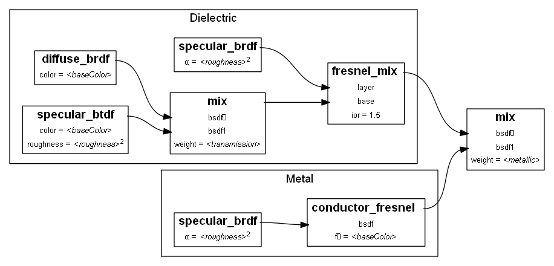
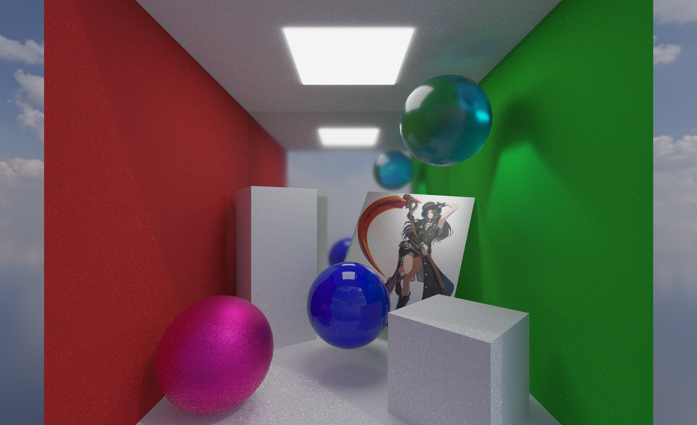
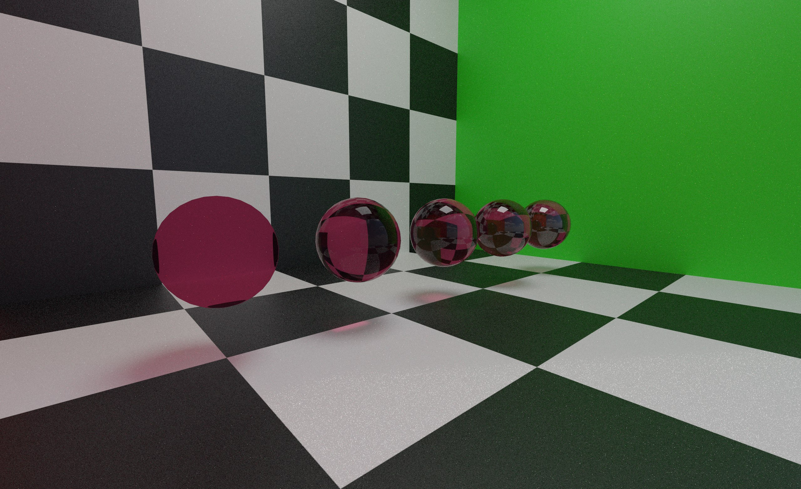
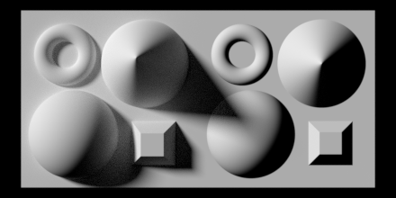
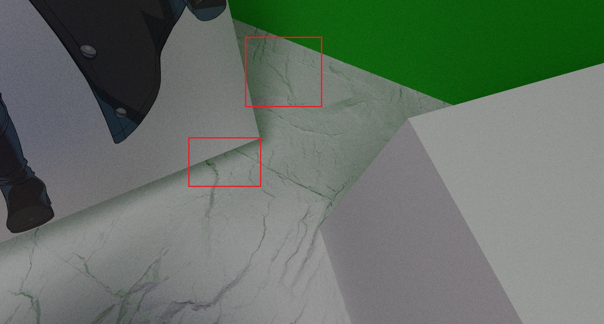
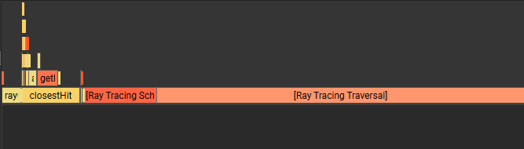


***Check out the repository for this project [here](https://github.com/SomeInternet/Mangetsu-Engine)!***


# About
A pathtracer graphics engine written in C++, Vulkan RT, and Slang. Inspired by my previous pathtracer graphics engine project, [Tsuki Engine](/technical/vulkan-cuda-pathtracer/), that implemented software pathtracing with Vulkan-CUDA interop.

*A render of the [Amazon Lumberyard Bistro](https://developer.nvidia.com/orca/amazon-lumberyard-bistro) scene, part of which I took into Blender and re-exported as a glb scene. You can access the glb version [here](https://drive.google.com/file/d/1IUR4zbtgZiPxAZCEbUySQ_30De5AmyWE/view?usp=sharing).*

# A Crash Course in Pathtracing
A quick motivation on pathtracing! It's an incredibly cool topic that merges art and low-level computer science. It also touches on a lot of math and physics that I'm not too well versed in, but find fascinating at a higher level.  
It might be a strange way to view the world, but if for every point in the world you could see, you knew exactly how much light was reaching it from all angles, and what proportion of that light was sent towards you, you'd be able to perfectly recreate the lighting of the scene. You can imagine this as integrating over the hemisphere (or sphere) the following equation, referred to as the **rendering equation** or **light transport equation**:


*Credit: https://pbr-book.org/3ed-2018/Light_Transport_I_Surface_Reflection/The_Light_Transport_Equation*

It looks mean, but the principle is quite simple: the light sent from a point \(p\) in a direction \(\omega_o\) (\(L_o(p, \omega_o)\)) is the light emitted from that point in that direction \(L_e(p, \omega_o)\) plus, for all directions \(\omega_i\), the light received at point \(p\) from \(\omega_i\), attenuated by the amount of light sent from \(\omega_i\) to \(\omega_o\) by point \(p\). \(|cos\theta_i|\), Lambert's Law, expresses the way light is spread over a larger area when it hits at a glancing angle, resulting in less illumination.

Unfortunately, this equation mostly isn't able to be analytically computed, so we approximate it using Monte Carlo estimation (hence Monte Carlo pathtracer). The idea is that if we take a bunch of samples, weighting the samples by the relative likelihood they were taken, then as we take more samples, we converge to the true integral. This is why the rendered image starts off noisy and begins to smooth out and look realistic.

We take these samples by tracing the paths light takes (hence the name). Doing this from light source to camera would be wasteful, as the camera is infinitely small, so we do it in reverse, from camera to light source. The way we scatter the rays off of surfaces is determined by the material properties of the surface, and we attenuate any light we receive at the terminus of the path by the proportion of red, green, and blue light the material would scatter from our inbound direction (\(\omega_i\)) to our outbound direction (\(\omega_o\)).

We terminate our path after either hitting a light source, hitting nothing, or after hitting a maximum depth, which is tunable.

# Current Features
*As of October 6, 2026*

## Hardware Ray Tracing in Vulkan
Vulkan provides ray tracing extensions that leverage specialized device hardware to accelerate ray-scene intersections, including acceleration structure construction and traversal.

I've also enabled shader execution reordering, which improves performance on supported hardware by sorting shader execution, reducing thread divergence.

Vulkan breaks the ray tracing pipeline into the invocation of several shaders, which I've put in `pathtracer.slang`. The `raygeneration` shader computes initial ray cast from the dispatch, then iterates through the loop, calling `TraceRay()` to traverse the acceleration structure, then `ReorderThread()` to reduce divergence with shader execution reordering (on supported hardware, otherwise it should be a no-op), and then `Invoke()` to invoke the `closesthit` shader. It handles updating the attenuation and outputting the final radiance.

Most of the work for shading is done in the closest hit, where I pick a lobe, sample a new direction, compute the BSDF, and return that information to the ray generation shader (more on this later).

The `miss` shader is called when no object in the scene was hit.

## glTF Loading
In `loader.h`, `loader.cpp`, I use the tinygltf library to load glTF files, a powerful format that can represent entire scenes with meshes, primitives, and instancing, along with the materials and textures to render them.

## Physically-based Materials
I support the `KHR_materials_emissive_strength`, `KHR_materials_ior`, and `KHR_materials_transmission` extensions. My resulting Cook-Torrance BSDF implementation looks like this:

*Credit: https://github.com/KhronosGroup/glTF/blob/main/extensions/2.0/Khronos/KHR_materials_transmission/README.md*

We break it down into several lobes. We have a metallic lobe following the Torrance-Sparrow microfacet model, which imagines the macrosurface being comprised of a bunch of perfectly mirror-like microscopic surfaces, with their own micronormals. The distribution of micronormals about the macronormal (i.e. how much they vary) depends upon the roughness of the material, where 0 is very mirror-like and 1 looks more diffuse.

Metals reflect according to the material's albedo, where plastic is imagined as having a gray-ish sheen atop a diffuse underlayer, where we get more reflection as our view angle becomes more grazing.

With a transmissive surface, the underlayer could be transmissive. We can therefore imagine glass as having `metallic = 0.f`, `transmissiveness = 1.f`.

I sample this by picking a random value between 0 and 1, then combining that with the material parameters to choose a lobe to sample from. Given I weight the samples in accordance to the rate at which I sample them, you can imagine that by averaging this over a large number of samples, I converge to the correct result without bias.

Here's a render showcasing the Cook-Torrance BSDF in action. You can get more diffuse-looking walls, a relatively smooth mirrorlike metallic wall, a rough metallic ball, a glossy plastic ball, and a refractive somewhat rough glass sphere all in one:

*A render of the `cornellbox_transmission.glb` scene.*

## Dielectric Refraction
As mentioned earlier, I support varying indices of refraction through the glTF extension `KHR_materials_ior` (though my implementation currently breaks at an IoR of exactly 1). By Snell's Law, the index of refraction influences how the transmitted ray's direction is impacted by the normal:

\(\frac{sin(\theta_1)}{sin(\theta_2)} = \frac{n_2}{n_1}\)  
where \(\theta_1, \theta_2\) are the angles of the incoming and outgoing ray segments from the normal, and \(n_1, n_2\) are the indices of refraction of the incoming and outgoing medium.

I'll note that my refractions aren't physically accurate: I assume an infinitely thin surface and treat all transmission as from air to glass. glTF has an extension for more realistic refractions, `KHR_materials_volume`, which I may support in the future.

Here's a render showcasing the effects of differing IoRs, where the spheres have, from left to right, IoRs of `1.001f, 1.25f, 1.5f, 1.75f, 2.f`.

*You can inspect this scene as `ior.glb`.*

## Thin Lens Camera (Depth of Field)
When you typically implement your first camera, you get a pinhole camera, in that the light lands on the "film" as if it were passing through an infinitely small pinhole. Everything is in perfect focus because all light landing at some point on the film must come from precisely one direction to make it through the pinhole. That jitter for anti-aliasing represents the fact that the pixel contains a small breadth of space, so light from slightly different directions can land within a single pixel.

To achieve depth of field, we introduce `lensRadius` and `focusDist`. `lensRadius` is the width of the hole that light comes through, and `focusDist` is the distance of the focus plane from the camera, where everything lying on the focus plane is in focus. We ensure that the focus plane is in focus by aiming our ray at the equivalent point on the focus plane that we would originally be aiming at, from a randomly selected point on the lens of the camera.

## Normal Mapping
Normal mapping achieves the appearance of greater detail in geometry by perturbing the normal of the surface. Each pixel represents the perturbed normal in the tangent space of the surface, where \(n = normalize(color * 2 - 1)\). So for a light hitting a rugged wall, you can capture some of the effects of certain pieces of the wall facing away from the light and therefore not receiving as much illumination by having the normal map perturb the normals of certain segments of the wall.

Given the \(TBN\) (tangent, bitangent, normal) matrix representing the tangent space of the surface and the perturbed normal, we compute a new \(TBN\) matrix in `applyNormalMap`.

These rugged patches of the surface do not cast shadows like they would if they were real geometry, but they look good enough for small details.

Here's a cool gif that demonstrates the limitations of normal maps:
  
*Credit: https://commons.wikimedia.org/wiki/File:Rendering_with_normal_mapping.gif*

Having implemented normal mapping, here's a demonstration of them in action:

*You can inspect this scene as `cornellbox_normals.glb`.*

It still captures a lot of the details that make the ground look believably textured, such as capturing the green bounce light from the wall.

## Image-Based Lighting
Ordinarily, a ray that doesn't intersect a scene would return a flat emissive color. To achieve more visually interesting results like a sky, and quickly, we could use an image called an environment map and sample from it instead. We use HDR images because they represent radiance values beyond the \([0, 1]\) range of ordinary colors, making them ideal for environments that cast light.

To sample from the image, we wrap the image to a sphere. The u coordinate we sample is influenced by the xz direction of our ray, and the v coordinate we sample is influenced by the y direction of our ray.

```
float2 uv = float2(atan2(WorldRayDirection().z, WorldRayDirection().x), asin(WorldRayDirection().y));
uv *= float2(1.f / (2.f * PI), -1.f / PI); //v is flipped
uv += float2(.5f);
```

This makes scenes with dimmer lights much more visually interesting, though without light sampling/importance sampling techniques can lead to high variance/fireflies if there is a particularly small, bright part of the image. In fact, the renders I've shown so far take a while to converge because of my choice of HDR. I've begun implementing MIS with alias tables to help resolve this.

# Benchmarks
*Benchmarks were taken on my Windows 11 laptop, with an RTX 5070 Mobile, 32GB RAM(5600MT/s), and an Intel Ultra 9 275HX (2.6GHz).*

The performance of the pathtracer is view-dependent, as it affects what parts of the acceleration structure the rays have to traverse. To lead with the big, impressive first stat, at 1920*1080p, averaging over 1000 frames (after the first 10 seconds) with the bistro scene at 2,829,226 triangles, I get an average of 20.321 ms/frame (49.2 frames per second), with a minimum of 19.6 ms/frame, median of 20.423 ms/frame, and maximum of 21.104 ms/frame.

I wish I could show the direct performance difference for what would normally be big performance optimizations like acceleration structures, but unfortunately (or fortunately, I guess) the hardware raytracing API builds the acceleration structure.

Digging a little deeper with NSight Graphics though, profiling a run in my `cornellbox_transmission.glb` scene, most of the time seems to be spent on the ray tracing traversal.



Active threads per warp is pretty high, at 27.5, but unallocated warps in active SMs is also high, at an average of 24.6 warps (51.2% occupancy). I believe that high register usage per thread could be a cause of this.

# Future Plans
I'm still working on the engine! Some features I'm working on next:
* Multiple importance sampling with alias tables for environment and light sampling
* Reducing register usage per thread to improve occupancy
* Volumetric refraction via `KHR_materials_volume`

# Third-Party Libraries
**VkBootstrap**  
Helper classes and functions to reduce the boilerplate of picking a Vulkan device and setting up Vulkan objects.

**SDL**  
For windowing, setting up a surface for Vulkan to present to.

**ImGUI**  
For the, erm, GUI.

**TinyglTF**  
For glTF loading.

**VMA**  
For managing memory allocations.

**STB**  
For image loading. 

# Attributions
**VkGuide**  
Provided resources on engine architecture and setup that I took inspiration from.

**Vulkan Docs Tutorial**  
Provided resources and sample code for writing a modern Vulkan application, engine architecture, glTF loading, and raytracing that were extremely helpful.

**University of Pennsylvania, CIS 4610/5610 Curriculum**  
Provided some resources on pathtracing I used.

**Physically-Based Rendering Textbook, 4th Edition**  
Used as reference for implementations of microfacet reflection and transmission.

**Khronos Group glTF Specs**

**NVIDIA Vulkan Hardware Raytracing Tutorial**

**Claude**  
I used Claude to set up the CMakeLists and dependencies, bounced a lot of my ideas off Claude in this project, and used as a resource to help me set up the Vulkan Raytracing API boilerplate and debug my code.
